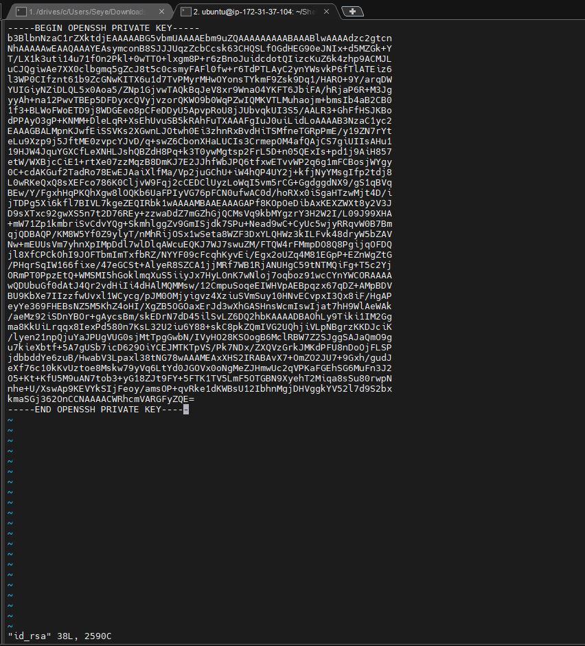

# AUX PROJECT 1: SHELL SCRIPTING

In this project I will be adding 20 new Linux users on to a server, by creating a shell script that reads a csv file that contains the first name of the users to be onboarded. 

First I will need to import onboard.sh script on to my instance.

Run the command below

<code>scp -i ade.pem onboard.sh ubuntu@18.132.12.87:~/;</code>

Now that the onboard.sh file was copied over successfully, I will have to update the file

Create a csv file name names.csv

<code> touch names.csv</code>

Open the names.csv file

<code>vim names.csv</code>

Now insert 20 names into names.csv file

save and exit.

Next I'm going to create a group called Developers, add the users to that group.

Create the group by running the command

<code> Sudo groupadd developers</code>

Next authorize keys for each user ssh configuration

<code>sudo chmod +x onboard.sh</code>

Next import the users onto Linux server, create authorized-key file for each user ssh configurtion

Next step is to update current user with the public and private key.

changed to .ssh folder, create file for both public and private key.

I'm going to update the public file first 

Save and Exit

Next is to update the private key

Save & exit.

Now I'm going to attempt to connect/access the Linux server using one of the user's that has been added to the server.

I was able to successfully user Liam to access the Linux server.

END..
